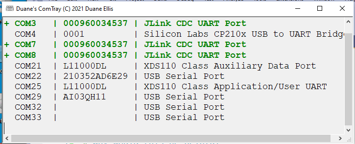
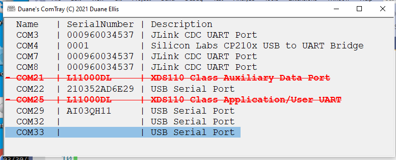

# Who will find this helpful?

This is a tool for SW Developers who deal with USB Serial Ports alot.

If you deal with USB Serial cables or devices, you'll find this thing helpful. 

# Problem statement:

I often plug and unplug little IoT type gadgets, debuggers and cables and 
I am for ever trying to figure out is this thing COM7, or is this one COM82?
In my line of work, COM305 is not uncommon.

# Solution is this tool

- Option 1 Double click on the ICON in the Windows SYSTEM TRAY

And the window will appear, you can copy/cut and paste

- Option 2 On Insert, window pops up for about 2.5 seconds

# Screenshots:

Can you guess which device was just plugged in?



And which device was just removed?



# About the code & history

- I wrote a C++ version at a previous place, they own that. 

- I wanted to relearn some C# - so I re-created it.

- About my C# code quality, basic statement: I suck at C# if you are good at it, you'll vomit at my C# quality.

- This is just a quick hack nothing more.

# Improvements I don't want:

- NO installer, just a single EXE file - so it's easy to setup on a lab machine.

- NO packages, this must means more DLL hell for poor bastards like me.

- Simple install: Just Copy EXE to startup folder

  For me, it is located here:
```
C:\Users\duane\AppData\Roaming\Microsoft\Windows\Start Menu\Programs\Startup
```

# To do

Add a right click menu (ContextMenu) to the Notify icon, and add an EXIT selection.
This was easier with an older version of C#, it's called a ContextMenuStrip now
and I'll add that another day.

# Build tools

I used Visual Studio Community 2019 - works for me.

